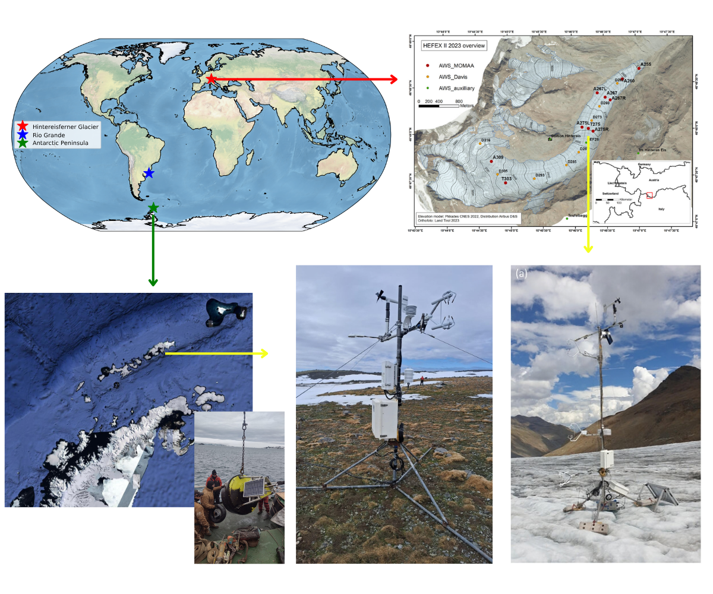

# CRYOEXTREMES Practical Workflows: Surface Energy Balance & Air-Sea/Ice Fluxes

This repository contains practical exercise material and workflows for analyzing the **Surface Energy Balance (SEB)** and turbulent heat fluxes using Eddy Covariance (EC) tower and oceanic/estuarine buoy measurements. 



During the course, participants work with real-world low- and high-frequency data collected in the Antarctic Peninsula during the Antarctic Modeling Observation System (ATMOS2) Project, at the Hintereisferner glacier (Austria) during the Second Hintereisferner Experiment (HEFEX II), and at the Patos Lagoon estuary. Additionally, for the Antarctic Peninsula, an oceanic buoy dataset is included to calculate air-sea heat fluxes. Full information regarding the HEFEX II experiment can be found in Nicholson et al. (2025).

> **Course Reference**: This material forms part of the practical modules for the **CRYOEXTREMES** course. For full details and lecture slides, visit the official site: [CRYOEXTREMES Course](https://cryohydromettools.github.io/CRYOEXTREMES.github.io/).

---

## 📚 Notebook Structure & Workflow

The analysis is structured sequentially across the practical Jupyter Notebooks:

### 1. Low-Frequency Data Preprocessing (`1_join_data_low_freq.ipynb`)
- Reads, parses, and cleans low-frequency meteorological time series.
- Configures datetime indexing, performs quality control, and handles missing data.
- Standardizes shortwave ($SW_{in}, SW_{out}$) and longwave ($LW_{in}, LW_{out}$) radiation components into structured Pandas DataFrames.

### 2. Surface Energy Balance Calculation (`2_seb_tower.ipynb`)
- Merges processed low-frequency meteorological observations with high-frequency Eddy Covariance (EC) tower flux measurements.
- Calculates Net Radiation ($R_n$), Sensible Heat Flux ($H$), Latent Heat Flux ($LE$), Soil Heat Flux ($G$), and the Energy Balance Residual ($R_n - H - LE - G$).
- Produces multi-panel time series plots for the energy budget components at Penguin Island.

### 3. Oceanic Buoy & COARE Bulk Flux Modeling (`3_bulk_buoy.ipynb`)
- Processes oceanic buoy observational data ($T_2$, $SST$, relative humidity, and wind speed).
- Executes the **COARE 3.5 bulk algorithm** (`coare35vn.py`, `meteo.py`, `util.py`) to estimate air-sea sensible ($H$) and latent ($LE$) heat fluxes across the Bransfield Strait.
- Generates diagnostic multi-panel figures comparing forcing variables ($T_2, SST, RH, WS$) and bulk fluxes.

### 4. Comparative Tower & Buoy Analysis (`4_comp_tower_bouy.ipynb`)
- Cross-compares simultaneous micrometeorological and turbulent flux observations between land-based tower systems and marine/aquatic buoy deployments.

### 5. Hintereisferner (HEF) Glacier SEB Analysis (`5_HEF_glacier.ipynb`)
- Analyzes high-resolution surface meteorological and Eddy Covariance flux data collected directly on the **Hintereisferner Glacier (HEF)** during HEFEX II.
- Computes Net Radiation ($R_n$) and evaluates ice/snow surface energy balance closure ($R_n - H - LE$).

### 6. Patos Lagoon Estuary Buoy Analysis (`6_Patos_Lagoon_estuary_bouy.ipynb`)
- Processes and analyzes estuarine buoy measurements from the **Patos Lagoon** system to evaluate surface forcing and aquatic-atmospheric exchanges.

---

## 🚀 Running on Google Colab

These notebooks are designed to be run directly in **Google Colab**. 

If additional packages are required within a session, you can install them at the beginning of the notebook.

---

## 📂 Repository Structure

```text
.
├── 0_map_loc.ipynb                  # 0. Study site mapping & localization
├── 1_join_data_low_freq.ipynb       # 1. Low-frequency data preprocessing
├── 2_seb_tower.ipynb                # 2. Tower SEB analysis & flux calculation
├── 3_bulk_buoy.ipynb                # 3. Buoy data analysis & COARE 3.5 flux modeling
├── 4_comp_tower_bouy.ipynb          # 4. Comparative tower vs. buoy analysis
├── 5_HEF_glacier.ipynb              # 5. HEF Glacier SEB analysis
├── 6_Patos_Lagoon_estuary_bouy.ipynb# 6. Patos Lagoon estuary buoy analysis
├── coare35vn.py                     # COARE 3.5 bulk algorithm script
├── meteo.py                         # Thermodynamic utilities for COARE
├── util.py                          # Helper functions for bulk flux calculations
├── img/                             # Course images (contains Fig_curso.png)
├── data/                            # Raw and processed datasets (ignored by Git)
├── fig/                             # Output figures and exported plots
├── .gitignore                       # Git ignore file for local data/cache
└── README.md                        # Project documentation

 ```


---


## 📖 References


**Nicholson, L., Stiperski, I., Nitti, G., Prinz, R., Georgi, A., Groos, A. R., et al. (2025).** The Second Hintereisferner Experiment (HEFEX II): Initial Insights into Boundary Layer Structure and Surface–Atmosphere Exchange Processes from Intensive Observations at a Valley Glacier. *Bulletin of the American Meteorological Society*, 106(10), E2143–E2169. https://doi.org/10.1175/BAMS-D-24-0010.1 